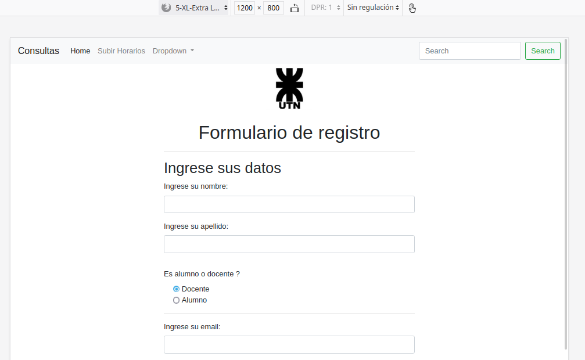
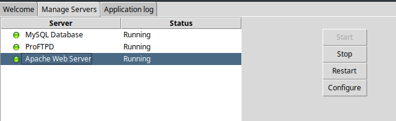

# Trabajo Practico Integrador

## Módulo: Aviso de Consultas

### Interfaces de Usuario

#### Formulario de Registro

** Tamaño de un teléfono**


** Tamaño de una PC**


### Objetivos del sitio
- Gestionar las solicitudes de consulta de los alumnos de la facultad.
- Gestionar los pedidos de consulta que reciben los profesores.
- Ofrecer un canal simple y rápido de comunicación entre los alumnos y los profesores.

### Requerimientos

Actividad | Hecho | Descripción
--|--|--
Crear solicitud de consulta.| NO | ...
Bloquear consulta. | NO | ...
Cancelar solicitud de consulta.| NO | ...
Filtrar grilla por Profesor y Materia| NO | ...
Ocultar operaciones por Tipo de Persona/Usuario| NO | ...
Subir un excel con los horarios de consulta prefijados.| NO | ...
Enviar mails (confirmación de consulta , informando que la consulta fue bloqueada ,informando al docente que un alumno canceló la consulta). | NO | ...
Generar informe diario de consultas que van a ser dadas.| NO | ...
Capacidad de registrar y validar usuarios, mantener sesiones.| NO | ...

### Reglas de negocio

1. RN-1: los Alumnos que se registraron a una consulta deberán ser informados cuando se da de baja(bloqueada) además de mostrar visualmente en la grilla que está bloqueada.
2. RN-2: Explicitar motivo de bloqueo ,Se debe indicar el motivo de bloqueo de una consulta (El Docente llenará un textbox).
3. RN-3: La grilla para visualizar los horarios de consulta es pública (sin login requerido).
4. RN-4: Una Consulta tendrá un cupo de alumnos que asistieron , el docente que da la consulta es el encargado de aprobar solicitudes a esa consulta , la aprobación de solicitud es secuencial , es decir , el profesor tendrá que aprobar las solicitudes por orden de llegada.
5. RN-5: Un Alumno podrá: solicitar una consulta , cancelar solicitud de consulta.
6. RN-6: Un Docente podrá, referido a sus consultas: bloquear una consulta , admitir solicitudes de alumnos a una consulta.
7. RN-7: para bloquear una consulta , un Docente debe justificar el motivo del bloqueo de la misma. El docente que bloquea una consulta debe proponer un horario alternativo, con excepción que el bloqueo cubra la semana.
8. RN-8:Por defecto el Docente tendrá solo sus consultas, (en la carga de la página de consultas se debe inicializar el filtro de profesor con su nombre).
9. RN-9: El usuario Administrador podrá: subir la grilla de horarios suministrada por DISI, bloquear y admitir solicitudes de alumnos en todas las consultas del sistema.
10. RN-10:Existe un periodo para que un alumno pueda cancelar una suscripción,una vez que termina el periodo para cancelar una consulta de parte del alumno , esta pasa a estado confirmada y automáticamente el sistema envía un mail al profesor informando.

## Código fuente

###  Conexión a base de datos desde PHP

- Iniciar MySQL y PHP  desde XAMPP



- Conexión desde PHP a base de datos y seleccionar la base **universidad**:

```php
//  mysqli_connect(): Inicializar conexión
// - Arg 1: Dirección/Nombre del host
// - Arg 2: Nombre de usuario (Se supone que el usuario root en MySQL tiene contraseña vacía. Puerto 3306 por default)
$link = mysqli_connect("localhost", "root") or die("Problemas de conexión a la base de datos");

// mysqli_select_db(): Seleccionar base de datos docentes usando la variable creada antes "$link"
// - Arg 1: Variable de conexión
// - Arg 2: Nombre base de datos
mysqli_select_db($link, "universidad");
```

- Crear y ejecutar instrucción sql:

**Con la base de datos y la tabla creadas**

```php

```

### Ejemplo de base de datos en MySQL

- Script para crear base de datos universidad con la tabla personas:
```sql
DROP SCHEMA IF EXISTS `universidad`;
CREATE SCHEMA IF NOT EXISTS `universidad` DEFAULT CHARACTER SET utf8 ;
USE `universidad` ;

DROP TABLE IF EXISTS `universidad`.`Persona`;
CREATE TABLE IF NOT EXISTS `universidad`.`Persona` (
  `Id_Persona` INT NOT NULL AUTO_INCREMENT,
  `Email_Personal` VARCHAR(45) NULL,
  `Nombre` VARCHAR(45) NULL,
  `Apellido` VARCHAR(45) NULL,
  PRIMARY KEY (`Id_Persona`))
ENGINE = InnoDB;
```

- Script para cargar datos en la tabla Persona:

```
-- No es necesario indicar el Id pero lo puse igual porque es solo para probar que ande.
INSERT INTO `Persona` (`Id_Persona`,`Email_Personal`,`Nombre`,`Apellido`) VALUES ('1','amolatex@mail.com ','Juan Ignacio','Torres');
INSERT INTO `Persona` (`Id_Persona`,`Email_Personal`,`Nombre`,`Apellido`) VALUES ('2','amobitcoin@mail.com ','Jose Luis','Feraboli');
INSERT INTO `Persona` (`Id_Persona`,`Email_Personal`,`Nombre`,`Apellido`) VALUES ('3','amocockburn@mail.com ','Alejandro','Rozas');
```
Tabla con los datos:

Id_Persona | Email_Personal | Nombre | Apellido | Tipo
--|--|--|--|--
1| amolatex@mail.com | Juan Ignacio | Torres | Docente
2| amobitcoin@gmail.com| Jose Luis | Feraboli | Docente
3| amocockburn@gmail.com| Alejandro | Rozas | Docente
