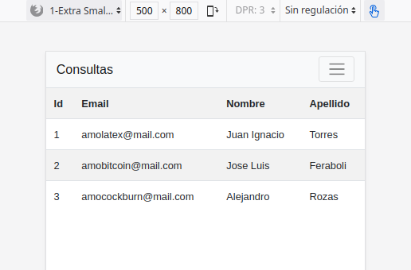
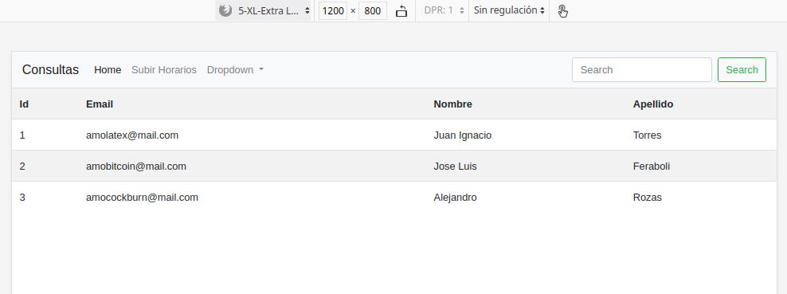
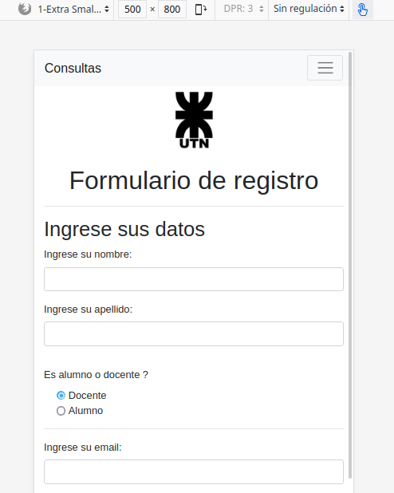

# Trabajo Practico Integrador

## Módulo: Aviso de Consultas

### Interfaces de Usuario

#### Prueba conexión a base de datos (tabla Persona)
*(En la parte de abajo del documento esta el código)*

Tamaño de un teléfon:



Tamaño de una PC:



#### Formulario de Registro

#####  Tamaño de un teléfono



#####  Tamaño de una PC


### Objetivos del sitio
- Gestionar las solicitudes de consulta de los alumnos de la facultad.
- Gestionar los pedidos de consulta que reciben los profesores.
- Ofrecer un canal simple y rápido de comunicación entre los alumnos y los profesores.

### Requerimientos

Actividad | Hecho | Descripción
--|--|--
Crear solicitud de consulta.| NO | ...
Bloquear consulta. | NO | ...
Cancelar solicitud de consulta.| NO | ...
Filtrar grilla por Profesor y Materia| NO | ...
Ocultar operaciones por Tipo de Persona/Usuario| NO | ...
Subir un excel con los horarios de consulta prefijados.| NO | ...
Enviar mails (confirmación de consulta , informando que la consulta fue bloqueada ,informando al docente que un alumno canceló la consulta). | NO | ...
Generar informe diario de consultas que van a ser dadas.| NO | ...
Capacidad de registrar y validar usuarios, mantener sesiones.| NO | ...

### Reglas de negocio

1. RN-1: los Alumnos que se registraron a una consulta deberán ser informados cuando se da de baja(bloqueada) además de mostrar visualmente en la grilla que está bloqueada.
2. RN-2: Explicitar motivo de bloqueo ,Se debe indicar el motivo de bloqueo de una consulta (El Docente llenará un textbox).
3. RN-3: La grilla para visualizar los horarios de consulta es pública (sin login requerido).
4. RN-4: Una Consulta tendrá un cupo de alumnos que asistieron , el docente que da la consulta es el encargado de aprobar solicitudes a esa consulta , la aprobación de solicitud es secuencial , es decir , el profesor tendrá que aprobar las solicitudes por orden de llegada.
5. RN-5: Un Alumno podrá: solicitar una consulta , cancelar solicitud de consulta.
6. RN-6: Un Docente podrá, referido a sus consultas: bloquear una consulta , admitir solicitudes de alumnos a una consulta.
7. RN-7: para bloquear una consulta , un Docente debe justificar el motivo del bloqueo de la misma. El docente que bloquea una consulta debe proponer un horario alternativo, con excepción que el bloqueo cubra la semana.
8. RN-8:Por defecto el Docente tendrá solo sus consultas, (en la carga de la página de consultas se debe inicializar el filtro de profesor con su nombre).
9. RN-9: El usuario Administrador podrá: subir la grilla de horarios suministrada por DISI, bloquear y admitir solicitudes de alumnos en todas las consultas del sistema.
10. RN-10:Existe un periodo para que un alumno pueda cancelar una suscripción,una vez que termina el periodo para cancelar una consulta de parte del alumno , esta pasa a estado confirmada y automáticamente el sistema envía un mail al profesor informando.

## Pruebas PHP

###  Conexión a base de datos desde PHP y MySQL

- Iniciar MySQL y PHP  desde XAMPP


- Probar conexión desde PHP y obtener datos de **universidad**:

Ver salidas al principio del documento en "Interfaces de Usuario"

```php
<?php

require('navbar.php');

$servername = "localhost";
$username = "root";
$password = "";

//  mysqli_connect(): Inicializar conexión
// - Arg 1: Dirección/Nombre del host
// - Arg 2: Nombre de usuario en la base de datos. Puerto 3306 por default.
// - Arg 3: Contraseña. (El usuario root en MySQL tiene contraseña vacía)
// - Arg 4: Nombre de la base de datos.

$link = mysqli_connect($servername, $username, $password) or die("Problemas de conexión a la base de datos");

// mysqli_select_db(): Seleccionar base de datos Persona usando la variable creada antes "$link"
// - Arg 1: Variable de conexión
// - Arg 2: Nombre de la base de datos
mysqli_select_db($link, "universidad");

$sql = "SELECT * FROM Persona";
$resultado = mysqli_query($link, $sql) or die (mysqli_error($link));;

// Verificar que existen registros cargados en la tabla Persona
if(mysqli_num_rows($resultado) == 0) {
    echo ("No existen docentes actualmente cargados al sistema. <br>");
}else{
    $total_registros = mysqli_num_rows($resultado);
    // echo("El total de registros es " . $total_registros);
?>
<table class="table table-striped table-hover">
<tr>    
    <th>Id</th>
    <th>Email</th>
    <th>Nombre</th>
    <th>Apellido</th>
</tr>
<?php

// Recorrer el arreglo con los resultados
while( $fila = mysqli_fetch_array($resultado))
{
?>
<tr>
    <td><?php echo ($fila['Id_Persona']);?></td>
    <td><?php echo ($fila['Email_Personal']);?></td>
    <td><?php echo ($fila['Nombre']);?></td>
    <td><?php echo ($fila['Apellido']);?></td>
</tr>
<?php
};};

// Liberar conjunto de resultados
mysqli_free_result($resultado);

// Liberar conexión
mysqli_close($link);

require('footer.php');

?>
</table>

```

- ABM desde PHP:

**Con la base de datos y la tabla creadas**

- GetAll docentes:

~~~php
<?php
//Conexión anteriormente creada en un archivo aparte
include ("conexion.inc");

$sql = "SELECT * FROM docentes";
$resultado = mysqli_query($link, $sql) or die (mysqli_error($link));;
if(mysqli_num_rows($resultado) == 0) {
    echo ("No existen docentes actualmente cargados al sistema. <br>");
}
~~~

### Crear  base de datos en MySQL

- Script para crear base de datos universidad con la tabla personas:
```sql
DROP SCHEMA IF EXISTS `universidad`;
CREATE SCHEMA IF NOT EXISTS `universidad` DEFAULT CHARACTER SET utf8 ;
USE `universidad` ;

DROP TABLE IF EXISTS `universidad`.`Persona`;
CREATE TABLE IF NOT EXISTS `universidad`.`Persona` (
  `Id_Persona` INT NOT NULL AUTO_INCREMENT,
  `Email_Personal` VARCHAR(45) NULL,
  `Nombre` VARCHAR(45) NULL,
  `Apellido` VARCHAR(45) NULL,
  PRIMARY KEY (`Id_Persona`))
ENGINE = InnoDB;
```


